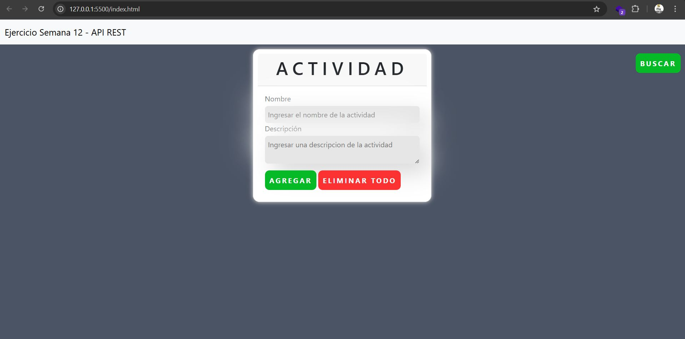

# Ejercicio con ```Api Rest``` que permite crear, editar y eliminar datos almacenados.

```Ahora has visto como funcionan las API's y como almacenar información atreves de solicitudes HTTP, entonces, usando el proyecto anterior (ToDo) modifícalo para usar una API-REST (json-server) y almacenar la información en un archivo JSON de esta forma evitar almacenarlo en el localStorage.Para tener un orden, tu proyecto deberá estar en un nuevo repositorio. Además de crear un readme explicando el uso de las propiedades que has utilizado en tu pagina web, como adicional a esto en el propio readme adjuntar captura de pantalla de la pagina.```


